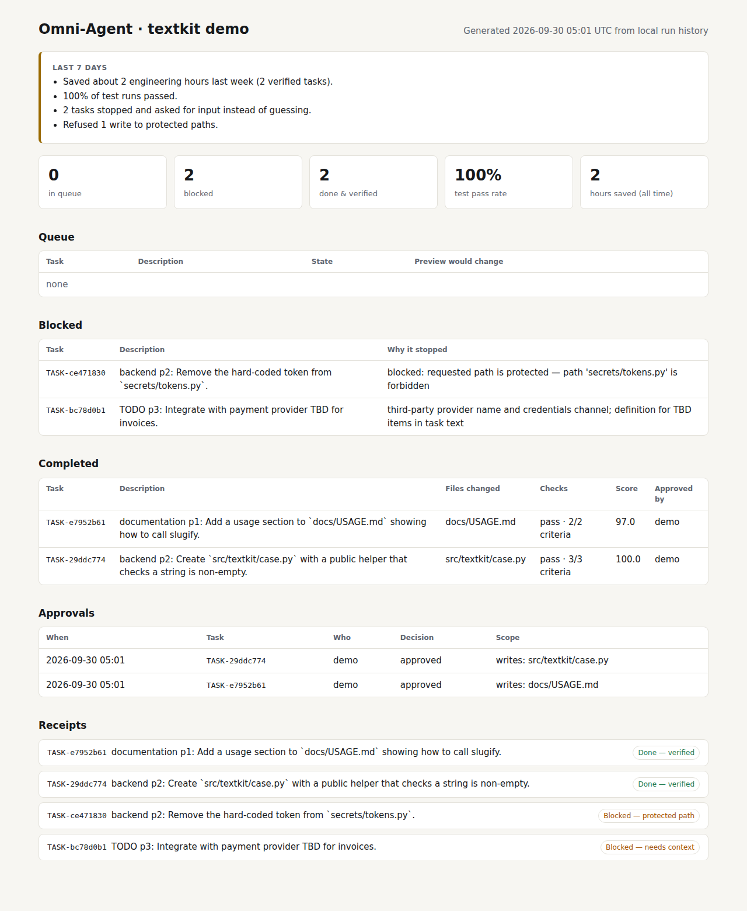
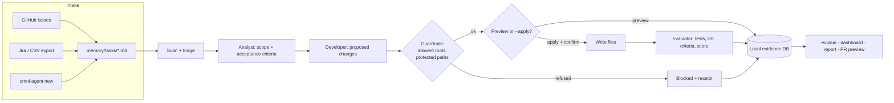

# Omni-Agent

**Turns backlog tasks into verified code changes with guardrails.**

Hand Omni-Agent the small repo tasks your team keeps putting off. It previews each change first. It writes only where you've allowed it to, runs your tests, and keeps a receipt: what changed, why, what passed, what was blocked, and what it refused to touch.

> Built for one job: **"I have a backlog of repo tasks and I want them done safely."**



## See it in 30 seconds

```bash
curl -fsSL https://raw.githubusercontent.com/empire1-cloud/omni-agent-github-app/main/scripts/install.sh | sh
omni-agent demo --open
```

`demo` copies a tiny sample repo into a temp folder and runs its four tasks end to end. It runs offline with no API key, and your own code is never touched:

```text
TASK-e7952b61  done             documentation p1: Add a usage section to `docs/USAGE.md` ...
TASK-29ddc774  done             backend p2: Create `src/textkit/case.py` with a public helper ...
TASK-ce471830  blocked_context  backend p2: Remove the hard-coded token from `secrets/tokens.py`.
TASK-bc78d0b1  blocked_context  TODO p3: Integrate with payment provider TBD for invoices.
```

Two tasks come back verified. One is refused because it points at a protected path. One stops because the task says "TBD", and Omni-Agent won't guess.

## Your first 10 minutes

```bash
cd path/to/your/repo
omni-agent quickstart          # 1. detect repo root + safe write roots, seed example tasks, preview task #1
omni-agent new "Fix the off-by-one in pagination" --template bugfix --path src/paginate.py --priority p1
omni-agent preview             # 2. see exactly which files the next task would touch (writes nothing)
omni-agent run-next --apply    # 3. confirm the file list, then it writes, tests, and scores the change
omni-agent explain TASK-…      # 4. the receipt
omni-agent dashboard --open    # 5. queue, blocked, completed, approvals, hours saved
```

`quickstart` only creates two files, `.omni-agent/config.yaml` and `memory/tasks/inbox.md`, and it never overwrites either one. It finds the repo root by walking up to `.git`. It then proposes write roots from the folders you already have (`src/`, `app/`, `lib/`, `tests/`, `docs/`, …). Run `omni-agent init` instead if you want to review or edit those roots before anything else happens.

No installer? From a checkout: `pip install .` or `python scripts/omni_agent.py <command>`.

## Proof on every task

Every run leaves a receipt built from the local run history, not from the model's own description of what it did. `omni-agent explain <task>` prints it (this one is from the demo repo):

```text
TASK-29ddc774 — Done — verified
  backend p2: Create `src/textkit/case.py` with a public helper that checks a string is non-empty.

WHY
  · must: File 'src/textkit/case.py' exists and is syntactically valid.
  · must: New backend module has at least one public callable defined.
WHAT CHANGED
  create   src/textkit/case.py
WHAT WAS CHECKED
  tests: pass  (python3 -m pytest -q tests)
  lint:  pass
  acceptance: 3/3 criteria met
WHAT WAS BLOCKED
  nothing
WHAT WAS PROTECTED
  no protected path was requested
WHO APPROVED
  approved by demo at 2026-09-30T05:01:07 — writes: src/textkit/case.py
```

A task only reaches **done** when its score clears the threshold (85 by default), combining acceptance criteria, tests, regression, lint, and guardrail compliance. Otherwise it stays open with the reason attached.

## Safe by default

- **Preview first.** `run-next` and `run-task` are read-only previews unless you pass `--apply`.
- **Confirm before writes.** With `--apply`, you see the exact file list and answer `y` before anything touches disk. Scripts must pass `--yes` explicitly. Without it, a non-interactive run refuses to write.
- **Allowed roots, set per repo.** Writes land only under `guardrails.allowed_paths`.
- **Always-protected paths.** `.env*`, keys, `secrets/`, `.git/`, and CI workflows are always protected. A task that asks for one is blocked, never redirected to some other file. Path traversal (`src/../.env`) is normalised before matching.
- **Approvals.** Set `safety.require_approval: true` and `--apply` will refuse until someone runs `omni-agent approve TASK-… --by <name>`. Every approval and every declined write is recorded.
- **No silent overwrites.** Without an LLM configured, the deterministic fallback only creates new files. It never rewrites existing code.

## Privacy

- **It runs locally.** The task engine runs on your machine, against your checkout.
- **No broad GitHub access.** The v1 GitHub App requests only `metadata: read` and never reads your source code. Issue import uses *your* token, read-only, and only when you ask for it.
- **It only modifies allowed areas.** See above. The allowlist lives in a file you can review in a PR.
- **It keeps evidence.** Every state change, file write, test run, refusal, and approval is stored in a local SQLite file (`.omni-agent/state/omni.db`).

## Why it helps

| You have… | Omni-Agent… |
|---|---|
| A backlog note like "add a usage section to the docs" | turns it into a validated change with a receipt |
| Small refactors spread across files you'd rather not open one by one | scopes the change to the named path and runs your tests |
| A pile of low-risk maintenance tasks | runs them overnight as previews, so you review file lists in the morning |
| Paths nobody should touch casually | refuses writes there and tells you it did |

## Before and after

| | Before | With Omni-Agent |
|---|---|---|
| Task intake | TODOs scattered across notes, issues, and Jira | One markdown queue: `import github` / `import jira` / `import csv` / `new` |
| Deciding what changes | Someone opens the files and explores | `preview` lists the files first; nothing is written |
| Doing the change | Manual, or an AI tool with the run of the repo | Writes only inside allowed roots, after confirmation |
| Knowing it worked | "Looks fine to me" | Tests, lint, and acceptance criteria scored per task |
| Reporting | Status meetings | `dashboard`: queue, blocked, done, approvals, hours saved |

## How it works



The Analyst, Developer, and Evaluator can each use an LLM (`persona_mode: hybrid` or `llm`). If the model is unavailable, they fall back to deterministic rules, so a run never depends on a model being up.

## Bring your tasks

Markdown stays the source of truth, but you don't need to write it by hand:

```bash
omni-agent import github --repo acme/api --label good-first-task   # uses GITHUB_TOKEN if set; read-only
omni-agent import github --file issues.json    # from: gh issue list --json number,title,body,labels,url
omni-agent import jira --file jira-export.csv  # Summary, Issue key, Priority, Labels… (repeated Labels columns ok)
omni-agent import csv --file backlog.csv       # title, priority, type, path, acceptance
omni-agent new "Document the retry policy" --template docs --path docs/retries.md
```

Each import is safe to re-run, because tasks already imported are skipped by their `[ref]`. Checkboxes in an issue body, or an `acceptance` column, become acceptance criteria. Any task can carry its own criteria:

```markdown
- [ ] backend p1: Validate email input in `src/signup.py` [gh#42]
  - Acceptance: Empty and malformed addresses return a 400.
```

## Team dashboard and outcomes

`omni-agent dashboard` writes a single self-contained HTML file (plus JSON) with the task queue, blocked work and the reason for each block, completed tasks with the files they changed, check results, scores, who approved what, protected-path refusals, and every receipt. It makes no network calls, so you can attach it to a status update as-is.

`omni-agent status` leads with plain-English outcomes for the last 7 days:

```text
• Saved about 2 engineering hours last week (2 verified tasks).
• 100% of test runs passed.
• 2 tasks stopped and asked for input instead of guessing.
• Refused 1 write to protected paths.
```

Hours saved are an estimate: verified tasks × `roi.minutes_per_task_manual` (default 60). Set it to match your team.

## Who it's for

- Small teams that already keep backlog notes in markdown and have lots of repetitive repo work
- Internal engineering ops: dependency notes, docs gaps, config tidy-ups
- Junior-dev support and repo cleanup, where you want a reviewable preview before anything lands
- Code-maintenance tasks where "don't touch these paths" really matters

It is **not** general-purpose AI coding for everything. Large features and cross-cutting redesigns still belong to people.

## CLI reference

| Command | What it does |
|---|---|
| `quickstart` / `init` | Set up a repo (detect root + write roots, seed examples) |
| `demo` | Full run on a bundled sample repo in a temp dir |
| `new`, `import github\|jira\|csv`, `scan` | Add tasks |
| `preview [TASK]` | Show what a task would change; never writes |
| `run-next`, `run-task TASK` | Preview, or with `--apply` write + test + score (`--yes`, `--by NAME`) |
| `approve TASK [--reject] [--by] [--note]` | Record an approval decision |
| `explain TASK` | Receipt: why / changed / checked / blocked / protected / approved |
| `status`, `dashboard`, `report`, `pr-preview TASK` | Outcomes and reporting |

Add `--json` to any command for machine-readable output. For the engine's internals, see [`omni_agent/README.md`](omni_agent/README.md).

## Pricing

| Plan | Price | For |
|---|---:|---|
| **Free** | $0 | Evaluate on a real repo: 25 tasks/month, rule mode, one workspace. **No credit card required.** |
| **Pro** | $49 / seat / month | Individuals: 500 tasks/month, AI + rule fallback, reports, ROI, PR previews |
| **Team** | $299 / workspace / month | Shared repos: 10 seats, 5,000 tasks/month, audit export, priority support |
| **Enterprise** | From $2,000 / month | Controlled deployments: self-hosted, SSO, custom policies |

Monthly plans can be cancelled anytime and stay active until the end of the billing period. Annual plans include two months free. The full feature matrix is in [`omni_agent/sales/pricing.md`](omni_agent/sales/pricing.md).

## GitHub App

The GitHub App layer is intentionally narrow in v1.

It supports:

- App Manifest creation and callback flow
- App JWT / installation-token authentication plumbing
- HMAC-SHA256 webhook verification
- `installation` events
- `installation_repositories` events
- GitHub Marketplace `marketplace_purchase` lifecycle events
- append-only installation / purchase audit records

### What the GitHub App does **not** do in v1

The App currently requests only `metadata: read`. It does **not** read repository contents, open pull requests, or post checks on its own.

That is deliberate: the task engine stays local, preserving the product promise that execution happens against the repository on the operator's machine. Expanding GitHub permissions is a later product decision, not a hidden requirement for v1.

## Stripe now, GitHub Marketplace as the channel

Omni-Agent supports two complementary commercial paths.

### Direct sale via Stripe

The backend can create Stripe Checkout Sessions for Pro and Team and verifies Stripe webhook events. No secrets are committed to this repository; checkout remains unavailable until the deployment environment is configured with real Stripe keys and Price IDs.

This is the direct-sale bridge for early customers.

### GitHub Marketplace

The code also includes the GitHub App installation and Marketplace webhook foundation. A paid Marketplace listing is a GitHub-side process with publisher/listing eligibility and review requirements, so the repository does **not** claim that Omni-Agent is already listed or approved.

When a Marketplace URL is configured, the frontend automatically promotes it as the primary self-serve path. Until then, the existing direct-sale and contact paths remain available.

See [`MARKETPLACE.md`](MARKETPLACE.md) for the current rollout checklist and [`DEPLOY.md`](DEPLOY.md) for deployment sequencing.

## Post-install experience


After installation, the App routes the operator to a real setup screen explaining the current boundary: the account is connected through GitHub, while the execution engine still runs locally against the repository.

## Running the API locally

The deployable backend uses Python 3.11.

```bash
pip install -r backend/requirements-deploy.txt
cd backend && uvicorn server:app --host 0.0.0.0 --port 8000   # then GET /api/health
```

`backend/requirements-deploy.txt` is the public-host-safe dependency set. The original `backend/requirements.txt` also references an Emergent-private package; outside that environment, Omni-Agent falls back when that optional LLM integration is unavailable.

## Deploy

A Render blueprint is included in [`render.yaml`](render.yaml) for two services:

- `omni-agent-api`
- `omni-agent-web`

The repository also includes [`backend/Dockerfile`](backend/Dockerfile) for container-based hosts.

Deployment credentials and external service URLs are environment configuration, not source-controlled values. Follow [`DEPLOY.md`](DEPLOY.md) for the current last-mile sequence.

## Repository map

```text
backend/                 FastAPI API, billing, GitHub App and services
frontend/                Public product / pricing web app
omni_agent/              Local guarded execution engine (`omni-agent` CLI in omni_agent/cli.py)
omni_agent/demo/repo/    Sample repo used by `omni-agent demo`
scripts/omni_agent.py    CLI entrypoint for a checkout
scripts/install.sh       One-line installer
memory/tasks/            Markdown task intake
render.yaml              Render deployment blueprint
DEPLOY.md                Deployment / activation sequence
MARKETPLACE.md           GitHub Marketplace path
```

## Product philosophy

Omni-Agent is not designed to silently roam a repository and call that autonomy.

The useful unit is **reviewable work with evidence**: what was requested, what was changed, what passed, what was protected, and what remains blocked.

That means the system favors explicit boundaries, persisted state, deterministic fallback behavior, and visible evaluation over hidden agent activity.

## Status

The production code stack for billing, deploy configuration, the GitHub App foundation, Marketplace-aware frontend behavior, and launch documentation has been integrated into `main`.

External activation still depends on operator-controlled steps such as deployment environment configuration, Stripe account configuration, creating/configuring the real GitHub App, publisher verification, and Marketplace submission.

## Built by Empire-1

Omni-Agent is an Empire-1 product.

Contact: **manda@empire1.cloud**
